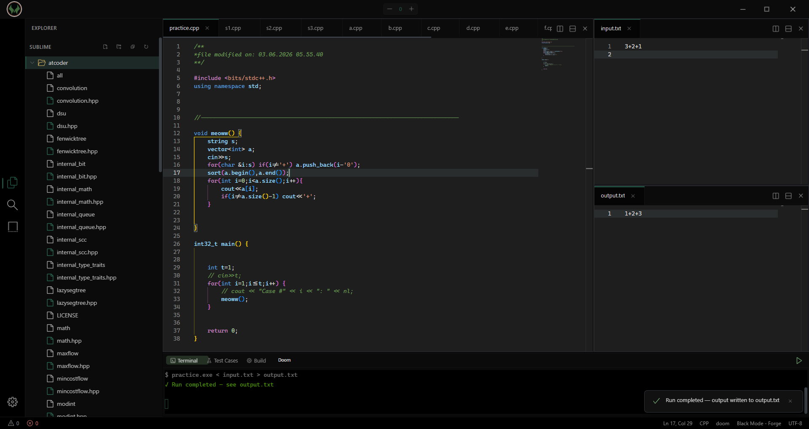
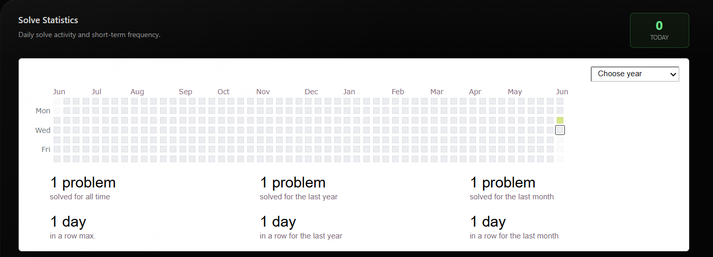
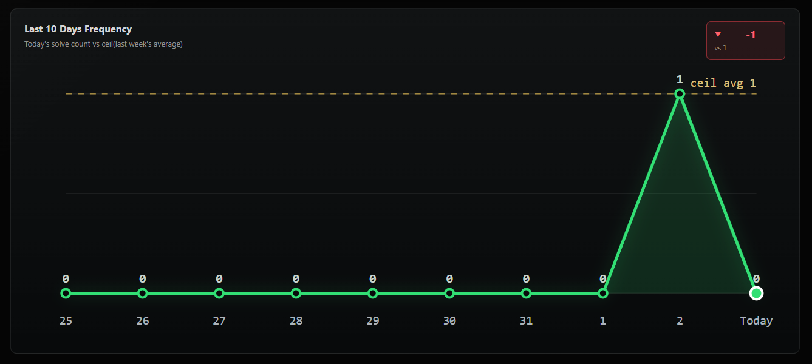
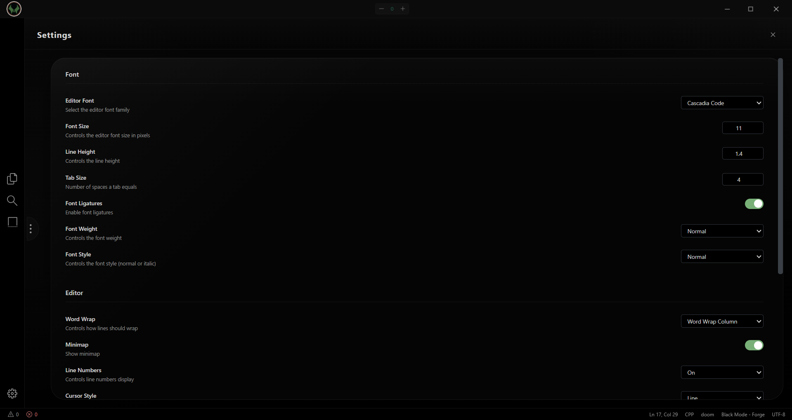

<p align="center">
  <a href="https://github.com/ig-vikas/Doom-Code-IDE">
    
  </a>
</p>

<h1 align="center">Doom Code</h1>

<p align="center">
  <strong>A blazing-fast, ultra-lightweight (~18 MB) C/C++ IDE designed for Competitive Programming and rapid development.</strong>
</p>

<p align="center">
  <em>Say goodbye to heavy Electron shells. Built on a Rust-powered Tauri backend and Monaco Editor frontend for instant, sub-second startup times and micro memory footprints.</em>
</p>

<p align="center">
  <a href="https://github.com/ig-vikas/Doom-Code-IDE/releases">
    
  </a>
  <a href="https://github.com/ig-vikas/Doom-Code-IDE/stargazers">
    
  </a>
  <a href="https://github.com/ig-vikas/Doom-Code-IDE/issues">
    
  </a>
  <a href="https://github.com/ig-vikas/Doom-Code-IDE/blob/main/LICENSE">
    
  </a>
  
  
  
  
</p>

---

## 🪟 Download for Windows

You can download the Windows installer from the latest/top GitHub Release:

[**Download Doom Code for Windows**](https://github.com/ig-vikas/Doom-Code-IDE/releases/latest)

---

## ⚡ Quick Start (60 Seconds)

Get up and running locally in three quick commands:

```bash
# 1. Clone the project
git clone https://github.com/ig-vikas/Doom-Code-IDE.git && cd Doom-Code-IDE

# 2. Install package dependencies
npm install

# 3. Spin up in Dev mode
npm run tauri dev
```

*Note: Ensure you have `g++` configured in your system `PATH`.*

---

## 📖 Table of Contents
* [🪟 Download for Windows](#-download-for-windows)
* [🚀 Why Choose Doom Code?](#-why-choose-doom-code)
* [📸 Screen Showcase](#-screen-showcase)
* [✨ Core Pillars & Features](#-core-pillars--features)
* [🧪 Predefined Compiler Profiles](#-predefined-compiler-profiles)
* [📚 CP Snippets Reference Cheatsheet](#-cp-snippets-reference-cheatsheet)
* [⚙️ Custom Settings Schema](#-custom-settings-schema)
* [⌨️ Keybinding Shortcuts](#-keybinding-shortcuts)
* [📂 Codebase Architecture](#-codebase-architecture)
* [🔮 Future Roadmap](#-future-roadmap)
* [🤝 Contributing & Support](#-contributing--support)

---

## 🚀 Why Choose Doom Code?

Traditional modern IDEs (like VS Code or standard Electron shells) boot up slowly, consume massive chunks of RAM, and require extensive third-party configuration to compile simple files.

Doom Code is built from the ground up for speed, lightness, and competitive coding efficiency.

```
                  ┌──────────────────────────────┐
                  │      React + Monaco UI       │
                  └──────────────┬───────────────┘
                                 │  Tauri IPC
                  ┌──────────────▼───────────────┐
                  │      Rust Backend Core       │
                  └──────────────┬───────────────┘
                                 │  Native OS Process
                  ┌──────────────▼───────────────┐
                  │      g++ compiler & xterm    │
                  └──────────────────────────────┘
```

* **Featherweight Size:** **~18 MB** installer footprint.
* **Instant Boots:** Re-opens your session and tabs in **< 1 second**.
* **CP-Built:** Built-in solve count trackers, expected-vs-actual output check panel, and snippet-injected algorithms.

---

## 📸 Screen Showcase

### 🖥️ 1. Main IDE Workspace
A clean, focused workspace combining Monaco Editor (the heart of VS Code), a custom file tree explorer, multi-tab navigation, and an interactive terminal.
<p align="center">
  
</p>

### 🎡 2. Animated Radial Menu
Quick-access action dial featuring smooth rotation animations. Launch command palettes, run compile jobs, or switch profiles in an instant.
<p align="center">
  
</p>

### 📊 3. Performance Analytics & Solve Counter
Visualize your daily competitive programming solve goals, speed milestones, and stats inside a sleek graphical dashboard.
<p align="center">
  
  
</p>

### ⚙️ 4. Preferences & UI Control
Modify autosave timers, custom layouts, compiler location paths, and aesthetic color tokens instantly.
<p align="center">
  
</p>

---

## ✨ Core Pillars & Features

### 1. Monaco Editor (VS Code Power)
Experience full IntelliSense, multi-cursor editing, bracket pair colorization, guides, auto-close quotes, and smooth scrolling parameters.

### 2. Competitive Programming Suite
* **Expected vs Actual Diff Viewer:** Run code against test suites and view side-by-side output mismatches.
* **Snippets Injection:** Pre-compiled standard structures (Graphs, Math, Trees) ready to be loaded via standard short prefixes.
* **Solve progression Tracker:** Log your problem solving numbers over time.

### 3. Native Integrations & Settings
* **Tauri 2.0 Rust Bindings:** Native OS file manipulation, shell command executions, and lightweight process threading.
* **Integrated Shell Emulator:** Powered by `xterm.js` with auto web-link detection and fit layout addons.
* **Session Persistence:** Auto-save settings and hot exits remember file tabs, layouts, and workspace structures.

---

## 🧪 Predefined Compiler Profiles

Compiler flags and behaviors are configured within `src/config/defaultBuildProfiles.ts`:

* **`TC` (Test Cases Profile)**
  * **Flags:** `-std=c++17 -O2 -DLOCAL`
  * **Timeout:** 5000ms
  * *Use-case:* Fast, optimized execution on test suite comparison scripts.
* **`Doom` (Standard Buffer - Default)**
  * **Flags:** `-std=c++17 -O2 -DLOCAL`
  * **Timeout:** 5000ms
  * *Use-case:* Standard file compiler and runner.
* **`Debug` (Validation Profile)**
  * **Flags:** `-std=c++17 -g -O0 -Wall -Wextra -Wshadow -D_GLIBCXX_DEBUG -DLOCAL`
  * **Timeout:** 10000ms
  * *Use-case:* Verbose warning reports, array index checks, and GDB compatibility support.
* **`Release` (Production Optimization)**
  * **Flags:** `-std=c++17 -O2 -Wall`
  * **Timeout:** 30000ms
  * *Use-case:* High-performance benchmark generation.

---

## 📚 CP Snippets Reference Cheatsheet

Save hours of boilerplate generation. Type the prefix and hit `Tab`/`Enter` in the editor:

### 🧩 Standard Structures
| Prefix | Description |
|---|---|
| `cptemp` | Pre-configured C++ Competitive Programming boilerplate template |
| `fastio` | Boosted standard input/output streams configurations |
| `segtree` / `lazysegtree` | Segment Tree (Point updates) / Lazy Propagation (Range updates) |
| `bit` | Binary Indexed Tree (Fenwick Tree) class setup |
| `dsu` | Disjoint Set Union with size heuristics & path compression |
| `sparse` | Sparse Table for Static Range Minimum Queries (RMQ) |
| `pbds` | Policy-Based Data Structures (Ordered Set & Multi-Set) |

### 🕸️ Graph Traversals & Trees
| Prefix | Description |
|---|---|
| `adjlist` / `wadjlist` | Unweighted / Weighted Adjacency Lists |
| `dfs` / `bfs` | Depth-First Search / Breadth-First Search snippets |
| `dijkstra` | Single Source Shortest Path finding |
| `bellman` | Bellman-Ford shortest paths |
| `floyd` | Floyd-Warshall All-Pairs Shortest Path |
| `toposort` | Topological Sorting on DAGs |
| `kruskal` | Minimum Spanning Tree generation |
| `lca` | Binary Lifting for Least Common Ancestor |

### 🔢 Mathematics & Number Theory
| Prefix | Description |
|---|---|
| `modpow` / `modinv` | Modular Exponentiation / Modular Inverse calculation |
| `sieve` | Prime numbers generation via Sieve of Eratosthenes |
| `ncr` | Modular Combinations calculation with factorial caching |
| `extgcd` | Extended Euclidean Algorithm ($ax + by = \gcd(a, b)$) |
| `miller` | Miller-Rabin Primality check |
| `crt` | Chinese Remainder Theorem implementation |

### 🧵 DP & Strings
| Prefix | Description |
|---|---|
| `dpknapsack` | 0/1 Knapsack recurrence template |
| `dplis` | Longest Increasing Subsequence in $O(N \log N)$ |
| `kmp` | Knuth-Morris-Pratt substring pattern matcher |
| `zfunc` | Z-algorithm for string prefix matching |
| `manacher` | Find longest palindromic substring in $O(N)$ |
| `sufarray` | Suffix Array and LCP calculation |

---

## ⚙️ Custom Settings Schema

Preferences are structured within `defaultSettings.ts`. Below is a breakdown of the standard schema format:

```json
{
  "editor": {
    "fontFamily": "Fira Code, Consolas, monospace",
    "fontSize": 15,
    "lineHeight": 1.7,
    "tabSize": 4,
    "minimap": false,
    "bracketPairColorization": true,
    "autoClosingBrackets": "always"
  },
  "ui": {
    "theme": "tokyo-night",
    "editorColorScheme": "one-dark-pro",
    "sidebarWidth": 260,
    "sidebarVisible": true,
    "bottomPanelHeight": 250
  },
  "build": {
    "compilerPath": "g++",
    "defaultProfile": "Doom",
    "saveBeforeBuild": true
  },
  "terminal": {
    "fontFamily": "JetBrains Mono, monospace",
    "fontSize": 14,
    "scrollback": 5000
  },
  "files": {
    "autoSave": "off",
    "exclude": [".git", "node_modules", "target", "*.exe", "*.o"]
  }
}
```

---

## ⌨️ Keybinding Shortcuts

| Shortcut | Command / Action |
|---|---|
| `Ctrl + Shift + P` | Open Command Palette / Fuzzy Finder |
| `Ctrl + S` | Save Active Buffer |
| `Ctrl + B` | Hide / Show File Explorer Sidebar |
| `Ctrl + J` | Open / Collapse Terminal Drawer |
| `Ctrl + Shift + B` | Compile & Run (Active compiler profile) |
| `Ctrl + ,` | Launch Preferences Window |

---

## 📂 Codebase Architecture

```
doom-code/
├── src/                    # React 18 UI Shell
│   ├── components/         # Editor workspace, Terminal drawer, Radial menu
│   ├── config/             # Themes, build profiles, shortcuts configuration
│   ├── editorSchemes/      # Monaco color schemes (Tokyo Night, Catppuccin, One Dark)
│   ├── hooks/              # UI layout state and window transition handlers
│   ├── services/           # Frontend operations (Compilation, Search, Files)
│   ├── stores/             # Zustand state management slices
│   ├── styles/             # Application styles and CSS resets
│   └── themes/             # Base UI theme configurations
├── src-tauri/              # Tauri Desktop Core (Rust backend)
│   ├── src/
│   │   ├── commands/       # Tauri Command IPC API bridges
│   │   ├── lib.rs          # Main Tauri Application core setup
│   │   ├── main.rs         # Application engine startup
│   │   └── state.rs        # Shared app instances (terminal states, compiler)
│   └── tauri.conf.json     # Tauri runtime capabilities config
```

---

## 🔮 Future Roadmap
- 🐛 **Visual GDB Debugger:** Toggle breakpoints, watch variables, and view stack traces within the workspace.
- 🎨 **Visual Template Builder:** Create custom boilerplate templates and project layouts through an interactive editor.
- 🌎 **Competitive Programming Syncing:** Sync problem sets and submit code solutions directly to Codeforces and AtCoder judges.
- ⚙️ **Clang/LLVM Support:** Support for alternative C/C++ compilation suites.

---

## 🤝 Contributing & Support

Contributions are what make the open source community such an amazing place to learn, inspire, and create. Any contributions you make are **greatly appreciated**.


Distributed under the MIT License. See [LICENSE](LICENSE) for more information.
