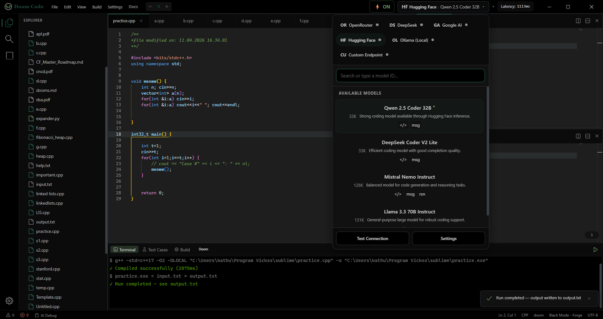

# Doom Code

Doom Code is a Tauri + React desktop IDE focused on competitive programming workflows with an integrated terminal, test-case runner, build tooling, and AI assistance.

## Screenshot



## Features

- Monaco-based code editor with tabs and file explorer
- Integrated terminal and output panels
- Build/test workflow support for quick iteration
- Command palette and customizable keybindings
- Multiple themes and editor color schemes
- AI provider integration (OpenRouter, DeepSeek, Google AI, Hugging Face, Ollama, custom endpoint)
- Workspace session restore and startup initialization flow

## Tech Stack

- Frontend: React + TypeScript + Vite
- Desktop runtime: Tauri 2
- Editor: Monaco
- Terminal UI: xterm.js
- State management: Zustand

## Getting Started

### Prerequisites

- Node.js 18+
- Rust toolchain (`rustup`, `cargo`)
- Tauri system dependencies for your OS

### Install

```bash
npm install
```

### Run in Development

```bash
npm run tauri dev
```

### Build Frontend

```bash
npm run build
```

### Build Desktop App

```bash
npm run tauri build
```

## Scripts

- `npm run dev` - Vite dev server
- `npm run build` - TypeScript check + Vite production build
- `npm run preview` - Preview frontend build
- `npm run tauri` - Tauri CLI passthrough (example: `npm run tauri dev`)

## Project Structure

- `src/` - React application code (UI, stores, services, hooks)
- `src-tauri/` - Tauri (Rust) desktop backend and app config
- `docs/images/` - Repository images used in documentation
