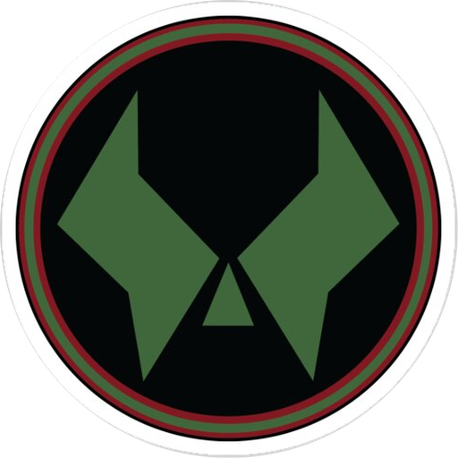

#  Doom Code

A Lightweight(13 MB) CPP IDE built with **Tauri**, **React**, and **Monaco Editor** — designed for speed, customization, and a seamless coding experience.

It uses inbuilt g++ to Build & Run


## Features

- **Monaco Editor** — VS Code's editor engine with full syntax highlighting, IntelliSense, and multi-cursor support
- **Integrated Terminal** — Built-in terminal powered by xterm.js
- **Build & Run** — Compile and execute C/C++ code with configurable build profiles (Debug, Release, Custom)
- **Test Cases** — Create, manage, and batch-run test cases with expected vs actual output comparison
- **File Explorer** — Full file tree with drag & drop, create, rename, delete, and folder operations
- **Command Palette** — Fuzzy-search commands with configurable keyboard shortcuts
- **Search & Replace** — Workspace-wide search with regex support
- **Snippets** — Code snippet manager with prefix-based insertion
- **Themes** — Multiple built-in themes (Tokyo Night, Dracula, Gruvbox, Nord, Monokai, and more)
- **Editor Color Schemes** — Separate Monaco editor color schemes (Catppuccin Mocha, One Dark Pro, GitHub Dark, etc.)
- **Custom Themes & Schemes** — Create and save your own UI themes and editor color schemes
- **Settings Panel** — Granular control over editor, terminal, UI, and build settings
- **Auto-Save** — Configurable auto-save with debounce
- **Session Restore** — Remembers open files, tabs, and layout across restarts
- **Solve Counter** — Track your competitive programming solve count
- **Resizable Panels** — Drag to resize sidebar, bottom panel, and editor areas
- **Custom Title Bar** — Native-feeling frameless window with custom controls

## Tech Stack

| Layer     | Technology                          |
|-----------|-------------------------------------|
| Frontend  | React 18, TypeScript, Zustand       |
| Editor    | Monaco Editor                       |
| Terminal  | xterm.js                            |
| Backend   | Rust (Tauri 2.0)                    |
| Build     | Vite                                |
| Bundler   | NSIS (Windows installer)            |

## Prerequisites

- [Node.js](https://nodejs.org/) (v18+)
- [Rust](https://www.rust-lang.org/tools/install) (latest stable)
- [Tauri CLI](https://v2.tauri.app/start/prerequisites/)

## Getting Started

```bash
# Clone the repository
git clone https://github.com/ig-vikas/Doom-Code-IDE.git
cd Doom-Code-IDE

# Install dependencies
npm install

# Run in development mode
npm run tauri dev

# Build for production
npm run tauri build
```

## Project Structure

```
doom-code/
├── src/                    # React frontend
│   ├── components/         # UI components (Editor, Sidebar, Terminal, etc.)
│   ├── config/             # Default settings, keybindings, themes, menus
│   ├── editorSchemes/      # Monaco editor color schemes
│   ├── hooks/              # Custom React hooks
│   ├── services/           # Business logic (build, file, search, etc.)
│   ├── stores/             # Zustand state management
│   ├── styles/             # Global CSS
│   ├── themes/             # UI themes
│   ├── types/              # TypeScript type definitions
│   └── utils/              # Utility functions
├── src-tauri/              # Rust backend
│   ├── src/
│   │   ├── commands/       # Tauri command handlers
│   │   ├── lib.rs          # Library entry point
│   │   ├── main.rs         # Application entry point
│   │   ├── state.rs        # Application state
│   │   └── utils.rs        # Rust utilities
│   └── tauri.conf.json     # Tauri configuration
├── package.json
├── tsconfig.json
└── vite.config.ts
```

## Keyboard Shortcuts

| Shortcut              | Action                 |
|-----------------------|------------------------|
| `Ctrl + Shift + P`   | Command Palette        |
| `Ctrl + S`           | Save File              |
| `Ctrl + B`           | Toggle Sidebar         |
| `Ctrl + J`           | Toggle Bottom Panel    |
| `Ctrl + Shift + B`   | Build & Run            |
| `Ctrl + ,`           | Open Settings          |

## License

This project is open source and available under the [MIT License](LICENSE).

## Contributing

Contributions are welcome! Feel free to open issues or submit pull requests.

---

> 95% of the core code is auto-generated by AI agents, continuously optimized through human-in-the-loop.

Built with caffeine and determination.
